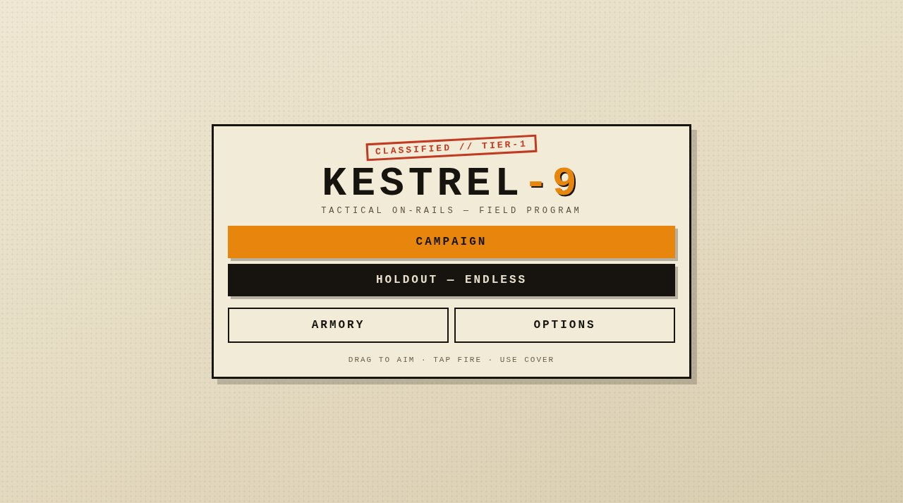

# KESTREL-9

A tactical on-rails shooter built for thumbs and mice.



**Live:** https://aeiouvcode.github.io/kestrel-9/

## About

Work through a classified field program of short missions: close-quarters rooms, scoped overwatch where targets must drop in the right order, and wire-cut defusals against the clock. Credits from kills, headshots and clean runs buy weapons in the Armory. Everything is earned in play. Holdout mode is the endless variant.

## Controls

- **Aim:** drag anywhere on the field
- **Fire:** hold FIRE (or click the field on desktop). Headshots drop hostiles instantly
- **Cover:** duck to become untouchable. You cannot fire from cover; reload there
- **Defusal:** cut wires in the order the panel flashes

Options include sound, difficulty and a progress wipe. Progress saves locally.

## Built with

A single `index.html` with Canvas 2D rendering and Web Audio. No dependencies and no build step.

A Godot 4 version of the same game lives at [kestrel9-godot](https://github.com/aeiouvcode/kestrel9-godot).

## Run locally

```sh
git clone https://github.com/aeiouvcode/kestrel-9.git
cd kestrel-9
python3 -m http.server 8000
```

Then open http://localhost:8000.
